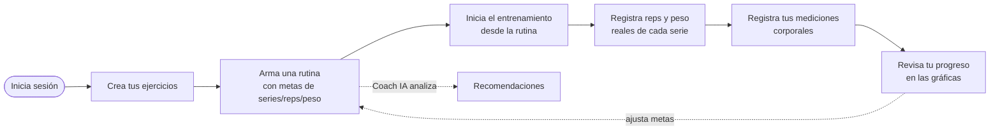
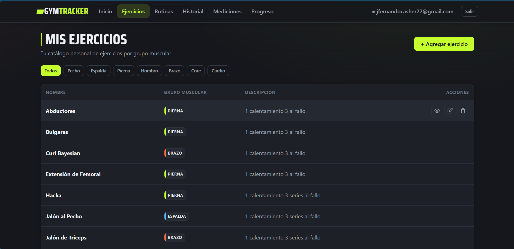
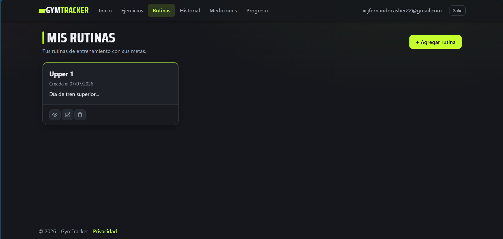
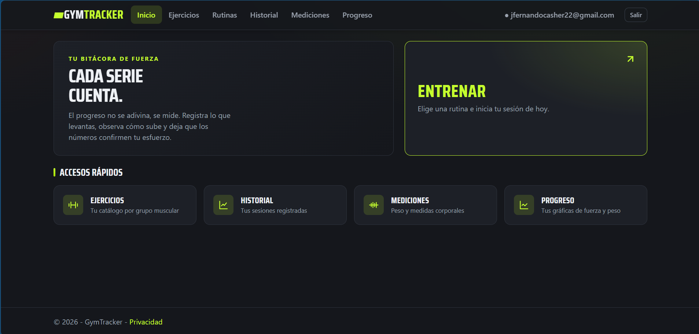
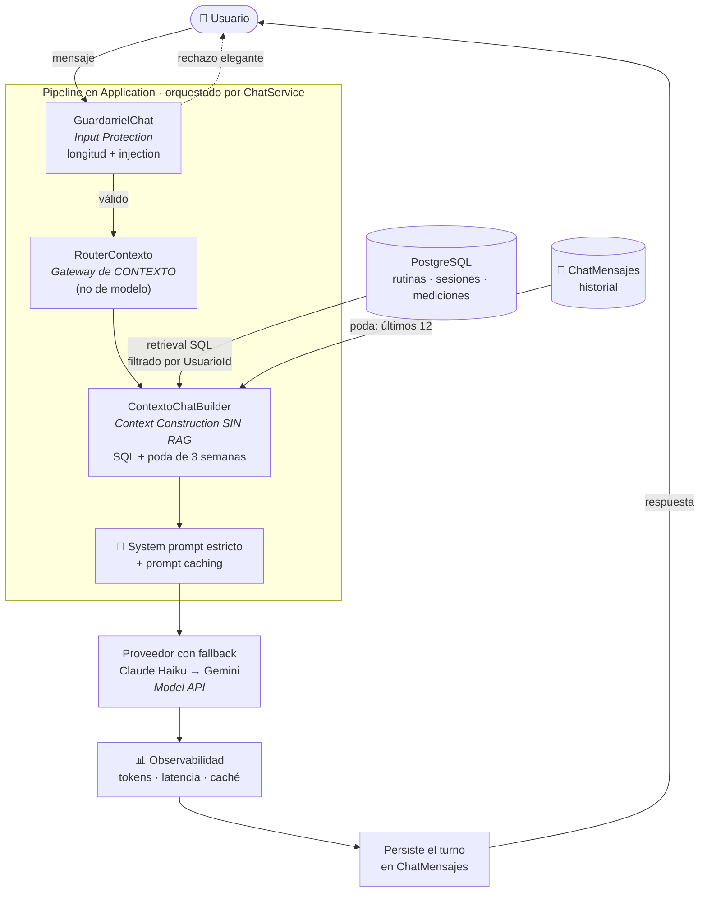

<a name="readme-top"></a>

<div align="center">

# GymTracker

**Bitácora personal de entrenamiento de gimnasio.**
Registra ejercicios, diseña rutinas con metas, guarda tus sesiones reales,
mide tu progreso corporal y visualiza tu evolución de fuerza con el tiempo.


</div>

---

## Tabla de contenidos

1. [Sobre el proyecto](#-sobre-el-proyecto)
2. [Funcionalidades](#-funcionalidades)
3. [Cómo usar GymTracker](#-cómo-usar-gymtracker-flujo)
4. [Vistas](#vistas)
5. [Tecnologías](#-tecnologías)
6. [Arquitectura y decisiones](#-arquitectura-y-decisiones)
7. [Ingeniería del Chatbot IA](#-ingeniería-del-chatbot-ia)
8. [Cómo ejecutar el proyecto](#-cómo-ejecutar-el-proyecto)
9. [Hoja de ruta](#-hoja-de-ruta)
10. [Uso de IA en el desarrollo](#-uso-de-ia-en-el-desarrollo)
11. [Agradecimientos](#-agradecimientos)
12. [Licencia](#-licencia)
13. [Autor](#-autor)

---

## 📖 Sobre el proyecto

**GymTracker** es una aplicación web construida como proyecto académico para la
materia de **Arquitectura de Software** (TSU en Desarrollo de Software). Su
propósito nace de un principio del entrenamiento de fuerza: la **sobrecarga
progresiva**. Para progresar de forma sostenida hace falta un registro objetivo
de lo que se levanta, sesión tras sesión. GymTracker es esa bitácora.

Cubre el **ciclo completo** del seguimiento de entrenamiento: desde la biblioteca
de ejercicios y el diseño de rutinas con metas, hasta el registro de lo que
*realmente* se hizo en el gimnasio, las mediciones corporales y las gráficas de
progreso. Incluye además un **Coach IA** que analiza tus rutinas, un **chatbot
con contexto** que responde sobre tus datos reales y un **catálogo de +1300
ejercicios con animaciones (GIFs)**.

<p align="right">(<a href="#readme-top">volver arriba</a>)</p>

---

## 🌟 Funcionalidades

| Módulo | Qué hace |
|--------|----------|
| **Catálogo de ejercicios** | Biblioteca personal (CRUD) organizada por grupo muscular. |
| **Rutinas con metas** | Combinaciones de ejercicios con objetivos de series, repeticiones y peso. Asignación dinámica con una tabla interactiva. |
| **Sesiones de entrenamiento** | Al iniciar una sesión desde una rutina se **congela un *snapshot*** de la rutina del momento, para que el historial sea inmutable aunque la rutina cambie después. Se registran los valores reales de cada serie. |
| **Mediciones corporales** | Peso (obligatorio) + composición corporal (% grasa, grasa visceral, masa muscular, % agua) y medidas con cinta (opcionales), a lo largo del tiempo. |
| **Progreso** | Tres gráficas Chart.js: evolución de peso corporal, volumen por sesión y progresión de carga por ejercicio. |
| **Catálogo con GIFs** | +1300 ejercicios con animaciones, servidos desde un *seed* local (sin llamar a APIs externas en runtime). Se vinculan a tus ejercicios propios para ver la técnica al entrenar. |
| **Coach IA** | Analiza una rutina (balance muscular y volumen) con un LLM y devuelve recomendaciones. Usa Claude Haiku con *fallback* a Gemini. |
| **Chatbot con contexto** | Asistente conversacional (widget flotante) que responde sobre tus datos reales —rutinas, sesiones, volumen y mediciones—. Pipeline de LLM con contexto podado (sin RAG), guardarrieles, *prompt caching* y observabilidad (ADR-07). |
| **API REST + Swagger** | Endpoints JSON para el catálogo y los datos de las gráficas, documentados con Swagger/OpenAPI. |
| **Autenticación** | Registro e inicio de sesión con ASP.NET Core Identity; cada usuario solo ve y edita sus propios datos. |

<p align="right">(<a href="#readme-top">volver arriba</a>)</p>

---

## 🔄 Cómo usar GymTracker (flujo)

El uso sigue el ciclo natural de la sobrecarga progresiva: **construyes tu
biblioteca → diseñas la rutina → entrenas y registras → mides tu avance.**



| Paso | Qué haces | Qué pasa por dentro |
|:----:|-----------|---------------------|
| 1 | Inicias sesión o te registras | ASP.NET Core Identity crea tu cuenta; a partir de aquí solo ves tus datos. |
| 2 | Creas ejercicios en tu catálogo | Se guardan por grupo muscular; puedes vincularlos a un GIF del catálogo. |
| 3 | Armas una rutina con metas | Asignas ejercicios con series/reps/peso objetivo en una tabla interactiva. |
| 4 | Inicias el entrenamiento | Se **congela un snapshot** de la rutina: aunque la edites después, la sesión conserva las metas del momento. |
| 5 | Registras la sesión real | Capturas reps y peso realmente ejecutados de cada serie. |
| 6 | Añades mediciones | Registras peso corporal y composición para seguir tu evolución física. |
| 7 | Revisas tu progreso | Tres gráficas resumen peso corporal, volumen por sesión y progresión de carga. |
| + | Consultas al Coach IA | Sobre una rutina, la IA evalúa el balance muscular y sugiere mejoras. |

<p align="right">(<a href="#readme-top">volver arriba</a>)</p>

---

## Vistas

<div align="center">

| Landing | Mis ejercicios | Rutinas |
|:---:|:---:|:---:|
|  |  |  |

</div>

<p align="right">(<a href="#readme-top">volver arriba</a>)</p>

---

## 🧰 Tecnologías

<div align="center">


</div>

| Capa | Tecnología | Rol |
|------|-----------|-----|
| Web / MVC | ASP.NET Core 10 MVC + Razor | Vistas, formularios y lógica de presentación |
| API REST | ASP.NET Core Web API + Swagger | Endpoints JSON (catálogo y datos de gráficas) |
| ORM | Entity Framework Core 10 | Acceso a datos y migraciones |
| Base de datos | PostgreSQL 16 (en Docker) | Persistencia |
| Autenticación | ASP.NET Core Identity | Usuarios y sesiones (cookies) |
| IA | Claude Haiku + Gemini (fallback) | Coach (análisis de rutinas) y Chatbot con contexto |
| Frontend | Bootstrap 5 + Chart.js | Estilos y visualización de datos |

<p align="right">(<a href="#readme-top">volver arriba</a>)</p>

---

## 🧱 Arquitectura y decisiones

GymTracker está organizado en una **arquitectura en capas con 4 proyectos
separados** (ADR-03), donde las referencias entre proyectos hacen que el
compilador imponga la separación de responsabilidades:

```
GymTracker.slnx
├── GymTracker.Domain          → Entidades y enums (núcleo, sin dependencias)
├── GymTracker.Application      → Servicios de negocio, DTOs e interfaces        → Domain
├── GymTracker.Infrastructure   → ApplicationDbContext, migraciones, Identity     → Domain, Application
└── GymTracker.Web              → MVC, API REST, Identity UI (composition root)   → Application, Infrastructure
```

Dirección de dependencia: **`Web → Application → Domain`**, con `Infrastructure`
proveyendo la persistencia. Todas las decisiones relevantes están documentadas
como **ADR** (Architecture Decision Records) en [`docs/ADR/`](./docs/ADR).

<details>
<summary><b>Aspectos destacados de la arquitectura</b> (clic para desplegar)</summary>

<br>

- **Arquitectura en capas (ADR-03):** los controllers no acceden al `DbContext`;
  la lógica de datos vive en servicios de la capa Application, inyectados por DI y
  dependientes de la abstracción `IApplicationDbContext`.
- **Patrones de diseño GOF (ADR-05):** el cálculo de volumen usa **Strategy +
  Factory Method**, permitiendo intercambiar fórmulas (tonelaje, series efectivas,
  volumen relativo) sin tocar el código que las consume.
- **Arquitectura de *snapshot*** en las sesiones: los datos de la rutina se
  congelan al iniciar el entrenamiento, garantizando un historial inmutable.
- **Coach IA con *fallback*:** interfaz común `IProveedorIA` con Claude como
  proveedor principal y Gemini como respaldo, orquestados por `ProveedorIAConFallback`.
- **Chatbot con contexto (ADR-07):** pipeline de LLM (marco de *AI Engineering* de
  Chip Huyen) que reutiliza el mismo gateway `IProveedorIA`. Construye contexto con
  **retrieval SQL + poda** (sin RAG), aplica **guardarrieles en capas** (el system
  prompt como defensa real), un **router de contexto**, **prompt caching** nativo y
  **observabilidad** de tokens/latencia. El estado conversacional se persiste en
  `ChatMensajes` (manejo de estado sobre una API *stateless*).
- **Catálogo con *seed* local (ADR-06):** el catálogo de +1300 ejercicios se lee
  de un JSON local cacheado en memoria; **no** se llama a la API externa en runtime
  (patrón cache-aside, para evitar rate limits y desacoplar el nº de usuarios).
- **Seguridad contextual:** los endpoints de catálogo son públicos, pero los de
  progreso requieren autenticación por exponer datos personales.
- **Gestión de secretos:** contraseñas y API keys nunca se versionan; viven en
  **User Secrets** (desarrollo) y variables de entorno (producción).
- **DTOs** en la API para evitar ciclos de serialización de EF Core.

</details>

<p align="right">(<a href="#readme-top">volver arriba</a>)</p>

---

## Ingeniería del Chatbot IA

El chatbot de GymTracker no es "otro *wrapper* de ChatGPT". Se diseñó como un
**pipeline de aplicación con LLM** siguiendo el marco de *AI Engineering* de **Chip
Huyen**, y su mayor valor es **arquitectónico**: cada etapa del pipeline se adaptó
—con trade-offs explícitos— a lo que *este* sistema realmente necesita, en lugar de
copiar el diagrama del libro tal cual. Toda la decisión está documentada en el
**[ADR-07](./docs/ADR/ADR-07-Fernando-Castro.md)**.

<div align="center">


<sub><i>Marco de referencia: <b>AI Engineering — Building Applications with Foundation Models</b>, Chip Huyen (O'Reilly).</i></sub>

</div>

### La arquitectura que diseñamos



> Compáralo con el diagrama del libro: las mismas cajas conceptuales (*context
> construction*, *input/output protection*, *model gateway*, *cache*, *agentic*),
> pero cada una **resuelta según la realidad de GymTracker**, no por inercia.

### Los 6 puntos: qué dice el libro vs. qué aplicamos aquí

| # | Etapa (libro) | Qué propone el libro | Qué aplicamos en GymTracker | Trade-off asumido |
|:-:|---------------|----------------------|-----------------------------|-------------------|
| 1 | **Context Construction** | RAG (embeddings + búsqueda vectorial) para hallar el fragmento relevante en texto no estructurado. | **Retrieval SQL + poda.** Los datos son **relacionales**, así que la consulta correcta es SQL exacto + agregación, no búsqueda por similitud. El crecimiento se acota con **poda por ventana de tiempo** (3 semanas, ya agregadas). | Menos "mágico" que RAG, pero **exacto y sin dependencias**. Un tonelaje se *suma*, no se *recupera por parecido*. |
| 2 | **Input Protection** | Filtrar/limpiar la entrada del usuario. | **Guardarriel determinista** (longitud + injection) como *higiene*, y el **system prompt estricto como defensa real**, marcando los datos como *datos-no-instrucciones*. | El regex solo, sería frágil y con falsos positivos; se relega a primera línea y el prompt hace el trabajo pesado. |
| 3 | **Model Gateway** | Enrutar a **modelos** distintos según la complejidad, para ahorrar. | **Router de CONTEXTO, no de modelo.** En mono-usuario con Haiku, cambiar de modelo ahorra ≈ $0; enrutamos *cuánto contexto cargar*, que es lo que **sí** mueve el costo. | Adaptación consciente del patrón: misma idea, palanca distinta. |
| 4 | **Cache** | *Exact* o *semantic caching* de respuestas. | **Prompt caching nativo** de Anthropic sobre el prefijo *system*. | *Exact*: hit-rate ≈ 0 en un chat; *semantic*: riesgo de responder "parecido" pero mal. El de prefijo es transparente y seguro. |
| 5 | **Output Protection** | Validar/moderar la salida del modelo. | Reglas en el system prompt: **no consejo médico**, **no inventar cifras**, mantenerse en dominio. | Suficiente para el alcance; una capa de moderación externa sería sobreingeniería aquí. |
| 6 | **Agentic ("do something automatically")** | Dar herramientas al modelo para que actúe en bucle. | **Descartado a conciencia.** | Bucle multi-turno, latencia y depuración a cambio de un beneficio marginal cuando las consultas son predecibles. |

### Las 4 piezas clave (y por qué importan)

- **`ChatService` — el orquestador.** Es el "director de orquesta": encadena las
  etapas (guardarriel → router → contexto → modelo → persistencia) y es donde vive
  el **manejo de estado conversacional**. La API del LLM es *stateless*; este
  servicio es quien convierte una secuencia de llamadas sin memoria en una
  conversación coherente, guardando y **podando** el historial en cada turno.
- **`RouterContexto` — decide cuánto "pensar".** Clasifica la intención
  (datos / consejo / general) para armar solo el contexto necesario. Un "hola" no
  arrastra tres semanas de sesiones. Es la pieza que **traduce el patrón *Model
  Gateway* a la palanca real de costo** de este sistema.
- **`ContextoChatBuilder` — el retrieval sin RAG.** Construye el contexto desde la
  base de datos con SQL **filtrado por `UsuarioId`** y **pre-agregado** (tonelaje
  por sesión y por grupo). Es la evidencia de que *no todo problema de contexto se
  resuelve con embeddings*: cuando los datos son estructurados, SQL gana.
- **`GuardarrielChat` — la primera línea de defensa.** Valida la entrada de forma
  determinista antes de gastar un solo token. Encarna un principio de seguridad:
  **fallar barato y temprano**, y no confiar la seguridad a una sola capa.

### Cómo esto reduce el costo real de la API (y por qué se mide)

Cada llamada a un LLM se paga **por token**. Las técnicas anteriores atacan el costo
por dos frentes concretos:

- **Poda de contexto** (etapa 1 + historial de 12 mensajes): mantiene el *input* en
  ~1–1.5K tokens **sin importar cuántos meses de datos acumule el usuario**. Sin
  poda, un atleta constante desbordaría la ventana o dispararía el costo con el
  tiempo. Es la diferencia entre un costo **acotado** y uno que **crece sin techo**.
- **Prompt caching** (etapa 4): dentro de una conversación, el prefijo *system* se
  **lee de caché** en los turnos siguientes en lugar de re-tokenizarse.
- **Router de contexto** (etapa 3): las preguntas triviales no cargan el contexto
  pesado.

Y aquí está lo importante: **no lo afirmamos, lo medimos.** Cada respuesta registra
**tokens de entrada/salida, tokens servidos de caché y latencia**, en los logs y en
la tabla `ChatMensajes`. Eso convierte "creo que es barato" en **evidencia
empírica** —se puede ver el ahorro del caché aparecer a partir del segundo turno—.

### Por qué esto vale en el mundo real

En un proyecto personal, el costo de un LLM son centavos y "no importa". En
producción, con miles de usuarios, **cada una de estas decisiones se multiplica** y
se convierte en la diferencia entre un producto rentable y uno que quema dinero. La
industria no valora "saber llamar a una API de IA" —eso lo hace cualquiera—; valora
a quien sabe **construir contexto con criterio, contener el costo, poner
guardarriles y, sobre todo, *medir*** lo que gasta y cómo rinde. Esta
implementación es, deliberadamente, un ejercicio de **esas** competencias: la
observabilidad y los trade-offs explícitos son exactamente lo que se espera de un
ingeniero que lleva IA a producción, no solo a una demo.

<p align="right">(<a href="#readme-top">volver arriba</a>)</p>

---

## 🚀 Cómo ejecutar el proyecto

**Requisitos:** .NET 10 SDK, Docker.

> Los secretos (contraseña de la base de datos y API keys de los LLMs) **no se
> versionan**: viven en **User Secrets** en desarrollo y en variables de entorno
> en producción. Por eso, al clonar el repo hay que configurarlos una vez.

```bash
# 1. Configurar la contraseña de la base de datos para Docker
#    Copia la plantilla y edita el valor de POSTGRES_PASSWORD.
cp .env.example .env          # en PowerShell: Copy-Item .env.example .env

# 2. Levantar la base de datos PostgreSQL en Docker
#    El contenedor se publica en el puerto 5433 del host (para no chocar con un
#    PostgreSQL nativo que use el 5432).
docker compose up -d

# 3. Dar a la app la connection string COMPLETA (con la misma contraseña del .env)
#    vía User Secrets. Sobrescribe la de appsettings.json (que va sin contraseña).
#    Los User Secrets viven en el proyecto Web (--project GymTracker.Web).
dotnet user-secrets set "ConnectionStrings:DefaultConnection" \
  "Host=localhost;Port=5433;Database=gymtracker;Username=gymtracker_user;Password=TU_CONTRASENA" \
  --project GymTracker.Web

# 4. (Opcional, solo si usas el Coach IA) Configurar las API keys de los LLMs
dotnet user-secrets set "Anthropic:ApiKey" "TU_API_KEY_DE_ANTHROPIC" --project GymTracker.Web
dotnet user-secrets set "Gemini:ApiKey" "TU_API_KEY_DE_GEMINI" --project GymTracker.Web

# 5. Aplicar las migraciones (el DbContext vive en Infrastructure; el arranque en Web)
dotnet ef database update --project GymTracker.Infrastructure --startup-project GymTracker.Web

# 6. Ejecutar la aplicación
dotnet run --project GymTracker.Web
```

La aplicación queda disponible en `https://localhost:44353` y la documentación de
la API (Swagger) en `https://localhost:44353/swagger`.

> **Nota sobre el puerto 5432:** si tienes un PostgreSQL instalado de forma nativa
> en Windows, suele ocupar el 5432 y le robaría las conexiones al contenedor. Por
> eso el contenedor de GymTracker se publica en **5433**. Si prefieres el 5432,
> cambia el mapeo en `docker-compose.yml` y el `Port=` de la connection string.

<p align="right">(<a href="#readme-top">volver arriba</a>)</p>

---

## Hoja de ruta

**Ya implementado**

- Catálogo, rutinas, sesiones con snapshot, mediciones y progreso
- API REST + Swagger
- Arquitectura en capas (4 proyectos)
- Catálogo de +1300 ejercicios con GIFs (seed local)
- Coach IA (análisis de rutinas con Claude + fallback a Gemini)
- Chatbot con contexto de entrenamiento (pipeline de LLM, ADR-07)

**Pendiente**

- **🧠 Generador de rutinas con IA** — crear rutinas a partir de un objetivo, con
  salida estructurada de un LLM (ver [`docs/PLAN-integraciones-IA.md`](./docs/PLAN-integraciones-IA.md)).
- **☁️ Despliegue en AWS** — Amazon RDS (PostgreSQL), ECS Fargate + ECR + ALB,
  Terraform (IaC) y GitHub Actions (CI/CD).


<p align="right">(<a href="#readme-top">volver arriba</a>)</p>

---

## Uso de IA en el desarrollo

Durante el desarrollo de GymTracker se usaron asistentes de IA (Claude) como
**apoyo educativo**, no como sustituto del aprendizaje. El criterio fue el
siguiente:

- **El diseño y las decisiones son propios.** Las decisiones arquitectónicas están
  razonadas y documentadas por el autor en los ADR.
- **Entender antes que copiar.** El código generado o sugerido se revisó, se
  comprendió y se adaptó manualmente antes de integrarse.
- **Aprendizaje, no atajo.** La IA se usó para explicar conceptos (patrones de
  diseño, arquitectura en capas, EF Core, manejo de secretos), acelerar tareas
  repetitivas y revisar código, reforzando lo visto en clase.


<p align="right">(<a href="#readme-top">volver arriba</a>)</p>

---

## Agradecimientos

- Al **Dr. Jorge Javier Pedrozo Romero**, por la guía, la retroalimentación y los
  contenidos impartidos en la materia de **Arquitectura de Software**. Muchos de
  los conceptos aplicados en este proyecto —patrones de diseño, arquitectura en
  capas, ADR, refactorización y deuda técnica— provienen directamente de sus
  clases y fueron la base para las decisiones documentadas aquí.

<p align="right">(<a href="#readme-top">volver arriba</a>)</p>

---

## 📄 Licencia

Proyecto **académico** con fines educativos (TSU en Desarrollo de Software ·
Arquitectura de Software). No se distribuye bajo una licencia open-source formal.

---

## 👤 Autor

**Jesús Fernando Castro Hernández**
Proyecto académico — TSU en Desarrollo de Software · Arquitectura de Software.

<p align="right">(<a href="#readme-top">volver arriba</a>)</p>
