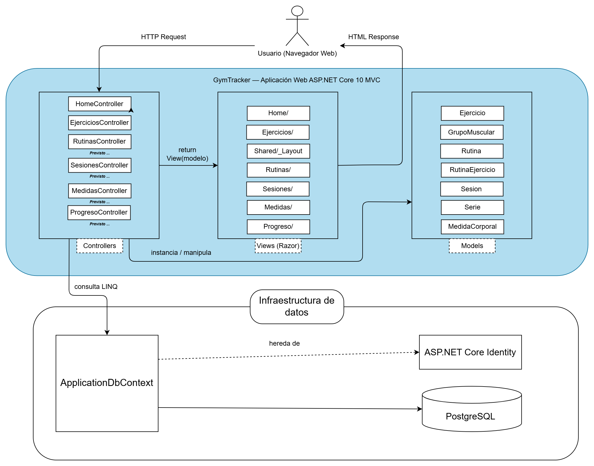

# ADR-01: Adopción del patrón MVC con ASP.NET Core como arquitectura base de GymTracker

| Campo  | Valor |
|--------|-------|
| Autor  | Fernando Castro Hernández |
| Fecha  | 13/05/2026 |
| Estado | Propuesto |

---

## Contexto

Llevo entrenando en el gimnasio más de dos años de forma constante, enfocado en hipertrofia. En ese tiempo he intentado llevar registro de mis rutinas y sesiones de varias formas: notas en el celular, mensajes a mí mismo en WhatsApp, hojas de papel, e incluso solo de memoria. Ninguna ha funcionado a largo plazo. El problema es que sin un registro estructurado es imposible saber si realmente estoy progresando, es decir, saber cuándo subí el peso por última vez en un ejercicio, cuántas semanas llevo estancado o qué rutina me funcionó mejor el mes pasado.

Este problema no es exclusivo mío. Cualquier persona que entrene con seriedad necesita algún tipo de registro para aplicar sobrecarga progresiva, que es el principio fundamental de cualquier progreso en el gimnasio. La mayoría de mis amigos del gym usan la app de notas del celular para esto, con los mismos problemas que yo tenía.

**GymTracker** es una aplicación web personal que pretende resolver esto: un sistema donde puedo registrar mi catálogo de ejercicios, armar rutinas con metas concretas de series y peso, registrar las sesiones que ejecuto en tiempo real, llevar mediciones corporales (peso, % grasa, perímetros), y ver el progreso real a lo largo del tiempo con gráficas.

El proyecto se desarrolla en el marco de la materia de Arquitectura de Software del tercer cuatrimestre de la carrera de Desarrollo de Software, lo cual condiciona varias decisiones: tengo 2 semanas para entregar un MVP funcional, soy estudiante de primer año todavía en formación, y debo trabajar con las tecnologías que el profesor enseña en clase. Específicamente, en esta materia estamos trabajando con ASP.NET Core MVC sobre .NET, usando Entity Framework Core como ORM. Mi conocimiento previo incluye C#, SQL básico, y nociones básicas de Docker que adquirí en otro proyecto.

---

## Decisión

Adopto el patrón arquitectónico **Modelo-Vista-Controlador (MVC)** como estilo base del proyecto, implementado con **ASP.NET Core 10 MVC**. La aplicación será una web monolítica que renderiza HTML del lado del servidor usando vistas Razor, persiste datos en **PostgreSQL** a través de **Entity Framework Core**, y gestiona la autenticación con **ASP.NET Core Identity**. PostgreSQL corre en local dentro de un contenedor Docker para evitar la instalación nativa del motor.

### ¿Por qué MVC?

MVC ofrece una separación de responsabilidades clara entre tres componentes con propósitos distintos: el **Modelo** representa los datos del dominio (ejercicios, rutinas, sesiones), la **Vista** se encarga únicamente de presentar información al usuario en HTML, y el **Controlador** orquesta el flujo recibiendo peticiones HTTP, decidiendo qué hacer con ellas y devolviendo la respuesta apropiada. Esta separación me obliga a no mezclar lógica de acceso a datos con presentación, lo cual es justamente el tipo de disciplina que necesito desarrollar como estudiante en formación.

La elección no es solo por simpleza pedagógica. MVC es el patrón estándar del desarrollo web del lado del servidor en el ecosistema .NET, y entender bien sus convenciones  me da una base directamente transferible a cualquier proyecto profesional en el stack de Microsoft. 

Sobre la base de datos: elegí PostgreSQL en lugar del SQL Server LocalDB que usamos en la primera practica, principalmente porque ya tengo nociones sólidas de SQL estándar, PostgreSQL es lo que se usaría en un entorno profesional o si decidiera desplegar el proyecto a un servidor en el futuro, y gracias a EF Core el cambio entre proveedores de base de datos es prácticamente transparente — si en algún momento el profesor solicita cambiar a SQL Server, es cuestión de reemplazar un paquete NuGet y una línea en `Program.cs`.

### Alternativas consideradas

| Alternativa | Por qué la descarté |
|-------------|---------------------|
| **MVP (Model-View-Presenter)** | Es un patrón conceptualmente similar a MVC pero donde la vista es completamente pasiva y toda la lógica de presentación vive en un componente llamado Presenter. Funciona bien en aplicaciones de escritorio (WinForms, Android nativo histórico), pero los frameworks web modernos como ASP.NET Core no están diseñados para implementarlo de forma natural.  |
| **MVVM (Model-View-ViewModel)** | Es el patrón dominante en frontend reactivo (Angular, Vue, .NET MAUI) y depende del *data binding* bidireccional: cambios en la vista actualizan el ViewModel automáticamente y viceversa. Tiene sentido en aplicaciones muy interactivas del lado del cliente, donde la UI cambia constantemente sin recargar. Para GymTracker, que es una app web renderizada en el servidor con Razor, MVVM sería sobre-ingeniería: implicaría aprender un framework de frontend adicional (React, Vue), construir un Web API separado en el back. |
| **Web API + frontend SPA separado** | Es la arquitectura más común en aplicaciones modernas a gran escala: un backend que expone endpoints REST y un frontend en React/Vue/Angular que los consume. Es lo que vamos a implementar en una segunda versión del proyecto en cuatrimestres posteriores. Lo descarto para esta primera iteración por tres razones: requiere construir efectivamente dos proyectos en lugar de uno, introduce complejidad adicional (manejo de tokens JWT, CORS, sincronización de estado entre cliente y servidor), y no es lo que el profesor está enseñando este cuatrimestre. Avanzar hacia esta arquitectura sin antes dominar MVC sería saltarse fundamentos importantes. |

---

## Consecuencias

**✅ Lo que gano:**

- **Técnico:** la separación entre modelo, vista y controlador me obliga a estructurar el código de forma ordenada desde el principio. Cuando necesite agregar una entidad nueva (Rutina, Sesión, Medida Corporal), el patrón ya me dice exactamente qué carpetas y qué archivos tocar, lo que reduce la fricción de cada nuevo módulo.

- **Proceso:** trabajar con el mismo stack que el profesor enseña significa que cualquier duda que tenga puedo resolverla en clase con referencias directas a lo que ya vimos. Las correcciones que él haga a mi trabajo van a ser específicas y aplicables, no genéricas. Esto acelera mi curva de aprendizaje porque puedo hacer preguntas técnicas concretas en lugar de pelear solo con un stack que él no conoce a fondo.

**⚠️ Lo que sacrifico o asumo:**

- **Limitación técnica:** al renderizar todo el HTML en el servidor con Razor, las interacciones del usuario implican necesariamente una recarga de página. No tendré la fluidez. Para un sistema personal de tracking esto es aceptable, pero limita la experiencia si en el futuro quisiera funcionalidades como un cronómetro entre series que se actualice cada segundo sin recargar.

- **Deuda futura:** si más adelante quiero construir una versión móvil real de GymTracker (no una web responsive, sino una app nativa con .NET MAUI o React Native), la arquitectura actual no me sirve: necesitaría reescribir el backend como Web API porque las apps nativas no consumen HTML, sino datos en JSON. Esto significa que el trabajo de este cuatrimestre es valioso como aprendizaje del patrón MVC y como MVP funcional, pero no es directamente reutilizable para una app móvil futura. Es una deuda consciente: prefiero terminar algo funcional y simple ahora, y migrar cuando tenga la madurez técnica para hacerlo bien.

---

## Diagrama

El siguiente diagrama muestra la arquitectura MVC de GymTracker en su estado actual. Las cajas con texto en "previstos" estan en el alcance del MVP pero aún no construidos.

*Archivo editable: [`adr-01-arquitectura-mvc.drawio`](adr-01-arquitectura-mvc.drawio)*