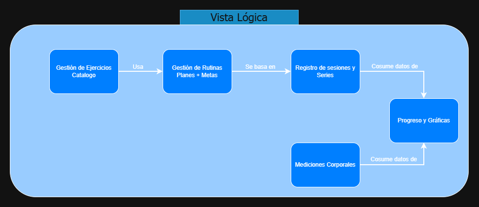
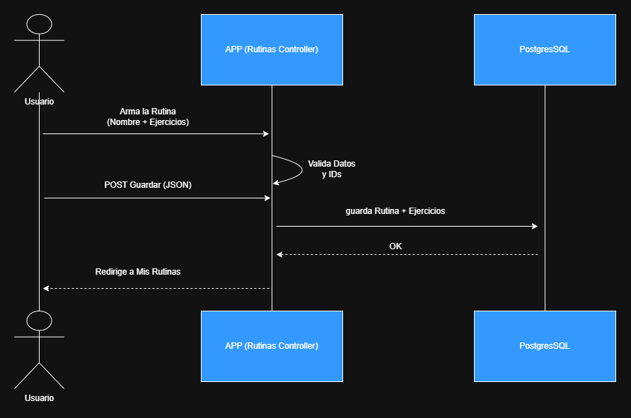
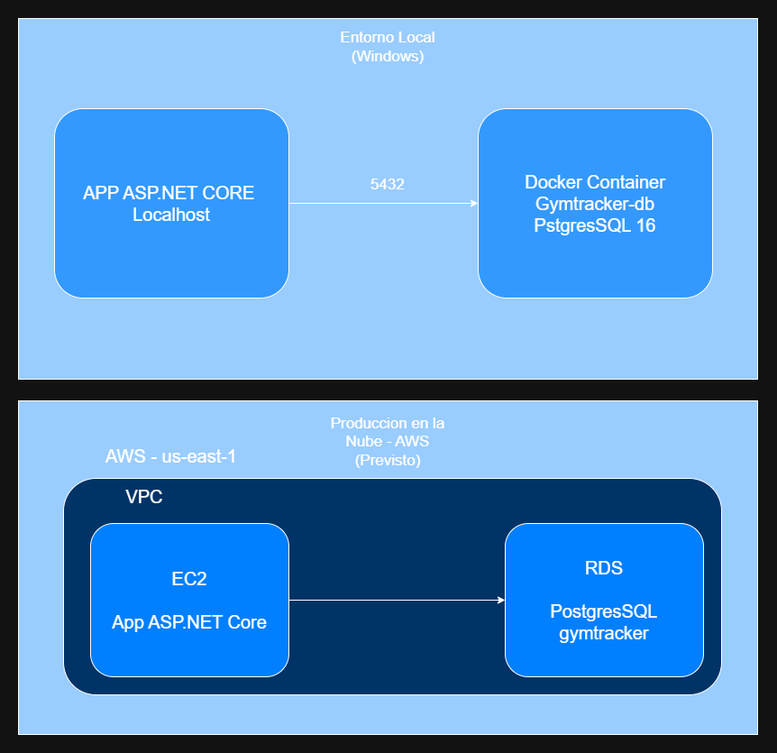

# ADR-02: Vistas arquitectónicas de GymTracker

| Campo  | Valor |
|--------|-------|
| Autor  | Fernando Castro Hernández |
| Fecha  | 04/06/2026 |
| Estado | Propuesto |

---

## Entorno

El ADR-01 estableció el patrón MVC con ASP.NET Core como arquitectura base de
GymTracker. Sin embargo, un solo diagrama no le responde a todas las audiencias de un sistema: a quien define el
alcance le importan los módulos, a un desarrollador le importa la estructura del
código, a quien analiza el comportamiento le importa el flujo en ejecución, y a
quien lo despliega le importa la infraestructura.

Este documento complementa al ADR-01 describiendo GymTracker desde cuatro vistas
arquitectónicas —**lógica, desarrollo, procesos y despliegue**— y los Trade-Offs que existen actualmente en el sistema.

---

## Trade-offs de las decisiones arquitectónicas

Toda decisión de arquitectura gana un atributo de calidad a costa de otro. No
existe la arquitectura perfecta: la decisión correcta depende del contexto del
proyecto. La siguiente tabla resume los trade-offs asumidos
conscientemente en GymTracker hasta esta versión.

| Decisión | Lo que gano | Lo que sacrifico |
|----------|-------------|------------------|
| MVC con Razor (HTML renderizado en el servidor) en lugar de Web API + SPA | **Simplicidad de desarrollo** y un solo proyecto; mismo stack que se enseña en clase, lo que reduce mi curva de aprendizaje | **Fluidez**: cada interacción recarga la página; el backend no es reutilizable tal cual para una app móvil nativa futura |
| Arquitectura monolítica en lugar de microservicios | **Simplicidad** de despliegue y depuración; todo el código vive en un solo lugar | **Escalabilidad independiente** por módulo (irrelevante para una app personal, pero queda documentado el costo) |
| PostgreSQL (relacional) en lugar de una base NoSQL | **Consistencia e integridad referencial**; guardar una rutina y sus ejercicios en una sola transacción | **Flexibilidad de esquema**: cada cambio de modelo obliga a crear y aplicar una migración |
| Autenticación con ASP.NET Core Identity (cookies de sesión) en lugar de JWT | **Seguridad** robusta lista para usar; puedo cerrar sesión e invalidar el acceso de inmediato | **Estado en el servidor**, lo que complicaría un escalado horizontal más adelante |
| Permitir guardar rutinas sin ejercicios (vacías) | **Flexibilidad de uso**: una rutina puede existir como plantilla y llenarse después | **Integridad del dominio**: pueden quedar rutinas vacías o sin sentido en la base |
| Despliegue local (`localhost`) con PostgreSQL en Docker, por ahora | **Costo cero** y entorno reproducible para desarrollar | **Disponibilidad**: la app no es accesible fuera de mi máquina (se contempla migrar a la nube más adelante) |

---

## 1. Vista lógica

Muestra las **responsabilidades funcionales** del sistema: qué módulos existen y
cómo se relacionan, independientemente de cómo estén escritos o dónde corran.



**Módulos:**

- **Gestión de Ejercicios** — el catálogo personal de ejercicios del usuario.
- **Gestión de Rutinas** — los planes de entrenamiento con sus metas (series,
  repeticiones y peso objetivo).
- **Registro de Sesiones y Series** *(previsto)* — el entrenamiento ejecutado en
  una fecha concreta.
- **Mediciones Corporales** *(previsto)* — peso, % de grasa y perímetros.
- **Progreso y Gráficas** *(previsto)* — la visualización de la evolución en el
  tiempo.

**Relaciones:** la Gestión de Rutinas *usa* el catálogo de Ejercicios para
componer sus planes; el Registro de Sesiones *se basa en* las Rutinas; y el
módulo de Progreso *consume datos de* Sesiones y de Mediciones. Todos los
módulos operan dentro del contexto de un usuario autenticado, de modo que cada
quien ve únicamente sus propios datos.

Los módulos en sólido están construidos; los marcados como *previsto*
pertenecen al alcance del MVP pero aún no se implementan.

**Audiencia:** quien define el alcance del producto (en este caso, yo mismo),
para confirmar que el sistema cubre todo lo que se necesita.

---

## 2. Vista de desarrollo

Muestra cómo está **organizado el código fuente**: proyectos, carpetas y la
dependencia entre ellos. Corresponde aproximadamente al Nivel 3 (Componentes)
del modelo C4.

```text
GymTracker/
│
├── Areas/Identity/        # Páginas de autenticación (Login/Registro - Scaffolded)
├── Controllers/           # Lógica de negocio y manejo de peticiones HTTP
│   ├── HomeController.cs
│   ├── EjerciciosController.cs
│   └── RutinasController.cs
├── Data/                  # Configuración de base de datos
│   └── ApplicationDbContext.cs (EF Core)
├── Migrations/            # Historial de cambios en el esquema de base de datos
│   ├── InitialIdentitySchema.cs
│   ├── AgregarEjercicios.cs
│   └── AgregarRutinas.cs
├── Models/                # Modelos de dominio y ViewModels
│   ├── Ejercicio.cs
│   ├── Rutina.cs
│   ├── RutinaEjercicio.cs
│   ├── Enums/
│   │   └── GrupoMuscular.cs
│   └── ViewModels/        # Modelos para vistas específicas
│       ├── CrearRutinaViewModel.cs
│       ├── EditarRutinaViewModel.cs
│       └── EjercicioEnRutinaViewModel.cs
├── Views/                 # Interfaz de usuario (Razor Views)
│   ├── Ejercicios/
│   ├── Rutinas/
│   ├── Home/
│   └── Shared/            # Layouts y componentes reutilizables
│       ├── _Layout.cshtml
│       └── _LoginPartial.cshtml
└── wwwroot/               # Archivos estáticos
    ├── css/
    ├── js/
    └── lib/               # Librerías externas (Bootstrap 5)
```

**Dependencias:** los *Controllers* reciben el `ApplicationDbContext` por
inyección de dependencias en el constructor y trabajan con los *Models* y
*ViewModels*; devuelven *Views* (Razor) que reciben esos modelos vía `@model`.
El `ApplicationDbContext` mapea los modelos de dominio a PostgreSQL a través de
EF Core, y las *Migrations* se generan a partir de ese contexto. Es un proyecto
único (monolito) con carpetas organizadas por responsabilidad MVC.

**Audiencia:** un desarrollador nuevo que pregunta "¿por dónde arranco? ¿dónde
está la lógica de crear una rutina?".

---

## 3. Vista de procesos

Muestra el **comportamiento en ejecución** del caso de uso más representativo del
sistema: crear una rutina con sus ejercicios. Es el flujo que mejor ilustra la
interacción entre cliente, servidor y base de datos.



**Flujo:** el usuario arma la rutina indicando nombre y agregando ejercicios; al
guardar, el `RutinasController` valida los datos y la propiedad de los IDs (que
los ejercicios pertenezcan al usuario), persiste la rutina junto con sus
ejercicios en una sola transacción de EF Core, y redirige al listado de rutinas.

Lo relevante de esta vista: el armado de la tabla de ejercicios ocurre del lado
del cliente, y el guardado completo se hace en una única transacción. Si la
operación fallara a la mitad, EF Core revierte (rollback) y no quedan rutinas a
medias en la base.

**Audiencia:** el arquitecto, para razonar sobre qué pasa ante fallos y qué es
síncrono frente a qué vive solo en el cliente.

---

## 4. Vista de despliegue

Muestra **dónde corre físicamente** el sistema. Se documenta en dos estados: el
actual (desarrollo local) y el previsto (producción en la nube), siendo honesto
sobre que el despliegue en AWS es un plan, no algo ya implementado.



**Estado actual (desarrollo):** la aplicación corre en mi máquina con el servidor
Kestrel en `localhost`, y se conecta por el puerto 5432 a una base PostgreSQL 16
que vive en un contenedor Docker (`gymtracker-db`). Ventaja: costo cero y entorno
reproducible. Limitación: la app no es accesible fuera de mi máquina.

**Estado previsto (producción en AWS, región us-east-1):** la aplicación viviría
en una instancia **EC2** y la base de datos en **RDS for PostgreSQL**, ambas
dentro de una **VPC**, con el tráfico HTTPS entrando por un Internet Gateway.
Esta migración es una decisión consciente a futuro y no requiere ningún cambio de
código gracias a EF Core (mismo proveedor PostgreSQL).

**Audiencia:** DevOps / sysadmin —en este caso yo mismo cuando haga la migración—
para saber qué hay que configurar para que funcione en producción.
