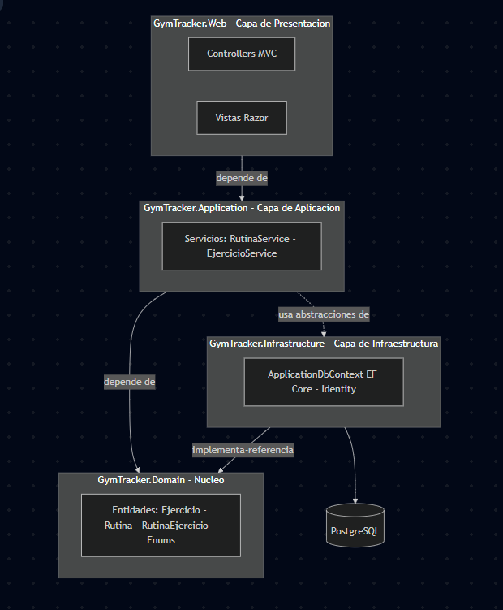

# ADR-03: Adopción de una arquitectura en capas (proyectos separados) para GymTracker

| Campo  | Valor |
|--------|-------|
| Autor  | Fernando Castro Hernández |
| Fecha  | 10/06/2026 |
| Estado | Propuesto |

---

## Contexto

El ADR-01 estableció el patrón MVC con ASP.NET Core como base de GymTracker. Esa
decisión resuelve *cómo* se atienden las peticiones web, pero no dice nada sobre
*cómo se organiza la lógica de negocio* dentro del sistema. Hoy esa lógica vive
acoplada en los controllers: por ejemplo, en `RutinasController.Agregar` la
validación de que los ejercicios pertenezcan al usuario (ownership) y la
construcción de la rutina con sus ejercicios se hacen directamente contra el
`ApplicationDbContext`. Los controllers conocen EF Core de primera mano y mezclan,
en un mismo lugar, la recepción de la petición HTTP con la lógica de negocio y el
acceso a datos.

Las características de mi sistema que hacen relevante esta decisión:

- **Un solo tipo de usuario.** GymTracker es una app personal mono-usuario (el
  atleta). No hay roles —administrador, entrenador, cliente— con capacidades
  distintas.
- **Va a crecer en funcionalidad.** Están previstos los módulos de Sesiones y
  Series, Mediciones Corporales, y Progreso con gráficas. Cada uno agrega lógica
  de negocio nueva, y todos seguirían el mismo camino: un controller que termina
  cargado de validaciones y consultas a EF Core.
- **Quiero poder probar la lógica.** Hoy, para verificar algo tan simple como "no
  puedo agregar a una rutina un ejercicio que no es mío", tendría que levantar la
  app y la base de datos, porque esa regla está enterrada dentro del controller.

El problema concreto: si sigo acumulando lógica dentro de los controllers,
GymTracker se vuelve más difícil de probar y de extender a medida que agrego
módulos. Cada nueva funcionalidad ensucia más los controllers y acopla la lógica
de negocio al framework web. Necesito un estilo que separe responsabilidades para
que el sistema crezca de forma ordenada y la lógica sea verificable de forma
aislada.

---

## Decisión

Adopto una **arquitectura en capas implementada con proyectos separados** dentro
de la misma solución. La lógica de negocio se extrae de los controllers hacia una
capa de **Aplicación (Servicios)**, y el sistema se organiza en cuatro proyectos
conectados por referencias:

```text
GymTracker.sln
├── GymTracker.Domain          → Entidades (Ejercicio, Rutina, RutinaEjercicio),
│                                 Enums y reglas del negocio. No depende de nadie.
├── GymTracker.Application      → Servicios con la lógica de negocio y la
│                                 orquestación de casos de uso. Depende de Domain.
├── GymTracker.Infrastructure   → ApplicationDbContext (EF Core), PostgreSQL,
│                                 Identity. Implementa la persistencia.
└── GymTracker.Web              → Controllers + Vistas Razor (mi proyecto actual).
                                  Depende de Application.
```

La dirección de dependencia es hacia el núcleo: `Web → Application → Domain`, y
`Infrastructure` provee la persistencia que la capa de Aplicación necesita. El
**Dominio es el núcleo** y no depende de ninguna otra capa.

Elijo **proyectos separados** (en lugar de simples carpetas dentro de un único
proyecto) porque las **referencias entre proyectos hacen que el compilador
imponga las capas**: `Web` puede referenciar a `Application`, pero `Domain` no
puede referenciar a `Web`, y el compilador no me deja romper esa regla aunque
quisiera. La separación deja de depender de mi disciplina y queda garantizada por
la estructura.

> **Nota sobre el momento de ejecución.** Esta es una decisión *adoptada*, no un
> cambio inmediato. El refactor a proyectos separados se ejecutará **al cerrar el
> MVP funcional** (después de completar las fases de desarrollo en curso), no a
> mitad del desarrollo de funcionalidades. Reorganizar la solución mientras sigo
> agregando features introduciría inestabilidad sin beneficio; hacerlo con el MVP
> estable es una sola pasada limpia. MVC se conserva: sigue siendo el patrón del
> proyecto `GymTracker.Web` (la capa de Presentación).

### ¿Por qué capas y no otro estilo?

El driver real de mi sistema es **crecer de forma ordenada y poder probar la
lógica de negocio de forma aislada**. Una arquitectura en capas resuelve
exactamente eso: al mover la lógica a servicios, los controllers quedan delgados
(solo reciben la petición, llaman al servicio y devuelven la respuesta) y la
lógica se puede probar sin levantar HTTP ni la base de datos. Cada módulo futuro
(Sesiones, Mediciones, Progreso) entra como un servicio nuevo siguiendo el mismo
patrón.

Como beneficio secundario, esta separación deja la puerta abierta a exponer en el
futuro un API REST (por ejemplo, para una app móvil) reutilizando los mismos
servicios sin reescribir la lógica. No es el motivo de la decisión —hoy solo
contemplo la aplicación web— pero es una ventaja que el estilo regala sin costo
adicional.

### Alternativas consideradas

| Alternativa | Por qué la descarté (por ahora) |
|-------------|--------------------------------|
| **Mantener la lógica en los controllers (sin capas)** | Es lo que tengo hoy y es lo más rápido a corto plazo, pero hace la lógica difícil de probar (requiere levantar app + BD) y empeora con cada módulo nuevo, porque toda la lógica se acumula en los controllers. Es justo el problema que esta decisión busca evitar. |
| **Capas como carpetas dentro de un único proyecto** | Es más simple que separar en proyectos y da algo de orden, pero la separación depende solo de mi disciplina: nada impide que un controller siga llamando directo al `DbContext`. Con proyectos separados, el compilador me obliga a respetar las capas. |
| **Arquitectura hexagonal (puertos y adaptadores)** | Tiene sentido si aparecieran varios adaptadores externos intercambiables. Para una app mono-usuario con un solo origen de datos es sobre-ingeniería hoy. La separación en capas es un paso previo natural hacia ella si algún día se justifica. |
| **Microservicios** | Sin sentido para un sistema mono-usuario y monolítico: agregaría complejidad operativa sin ningún beneficio real. |

---

## Decisión de infraestructura — ¿dónde va a correr?

Hoy el sistema corre en `localhost` (Kestrel + PostgreSQL en Docker). El plan de
despliegue a AWS contempla, a grandes rasgos: empaquetar la app en un
**contenedor**, mover la base de datos a **RDS for PostgreSQL**, y desplegar el
contenedor en **ECS Fargate** (modelo cloud-native gestionado). Descarto **AWS
Lambda** de forma consciente: GymTracker es un monolito con estado de sesión
(Identity por cookies) y conexión persistente a la base de datos, un perfil que
encaja en un contenedor de larga vida (EC2/ECS), no en el modelo efímero y
stateless de Lambda.

**¿Esta decisión cambia el estilo elegido? No.** La arquitectura en capas es
independiente de dónde corre: la solución con sus cuatro proyectos se compila en
un solo ejecutable que corre igual en `localhost` o dentro de un contenedor sobre
Fargate. Tener proyectos separados es una organización del *código fuente*, no
del despliegue: al final se empaquetan juntos en una sola imagen de contenedor.
Pasar a un despliegue cloud-native significa **containerizar el monolito en
capas**, no partirlo en microservicios. Por eso la infraestructura es coherente
con el estilo y ninguna fase del plan obliga a tocar la organización interna.

---

## Consecuencias

**✅ Lo que gano:**

- **Lógica testeable de forma aislada.** Al mover reglas como la validación de
  ownership de `RutinasController.Agregar` a un servicio, esa lógica se puede
  probar con tests unitarios sin levantar HTTP ni la base de datos.
- **Controllers delgados.** Los controllers quedan reducidos a recibir la
  petición, llamar al servicio y devolver la respuesta, lo que los hace más
  fáciles de leer y mantener.
- **Crecimiento ordenado.** Cada módulo previsto (Sesiones, Mediciones, Progreso)
  entra como un servicio nuevo siguiendo el mismo patrón, sin ensuciar los
  controllers ni duplicar acceso a datos.
- **Cambios de persistencia aislados.** Si cambio el proveedor de datos o el ORM,
  el impacto queda contenido en `GymTracker.Infrastructure`; el Dominio y la
  Aplicación no se enteran.
- **Capas garantizadas por el compilador.** Las referencias entre proyectos
  impiden estructuralmente que se rompa la separación.
- *(Secundario)* Deja preparado el terreno para un API REST futuro sin reescribir
  la lógica, si algún día se quisiera una app móvil.

**⚠️ Lo que sacrifico o la complejidad que agrego:**

- **Más ceremonia para operaciones triviales.** Un CRUD simple como "crear
  ejercicio" pasa ahora por controller → servicio → contexto, en lugar de
  controller → contexto. Para las partes más simples del sistema, eso es
  boilerplate que antes no existía. *(Trade-off concreto #1.)*
- **Trabajo de refactor sin features visibles.** Hay que reescribir los
  controllers actuales (`EjerciciosController`, `RutinasController`), que hoy
  llaman directo al `ApplicationDbContext`, moviendo su lógica a servicios y
  repartiendo el código en cuatro proyectos. Es esfuerzo que no agrega
  funcionalidad nueva para el usuario. *(Trade-off concreto #2.)*
- **Más piezas que coordinar.** Cuatro proyectos con sus referencias y namespaces
  son más complejos de navegar que un proyecto único, sobre todo para alguien que
  recién llega al código.
- **Riesgo de sobre-ingeniería si el sistema no creciera.** El valor de esta
  estructura se paga conforme agrego módulos; en un sistema que se quedara
  pequeño y estático, parte de esta separación no se justificaría.

---

## Relación con decisiones anteriores

Esta decisión **no contradice** el ADR-01: MVC sigue siendo el patrón de la capa
de Presentación, dentro del proyecto `GymTracker.Web`. Lo que el ADR-03 agrega es
la organización en capas del resto del sistema, para que la lógica de negocio deje
de vivir dentro de los controllers y el sistema pueda crecer de forma ordenada y
verificable.

## Diagrama de Arquitectura de Capas que se podría implementar (_PROPUESTO_)

