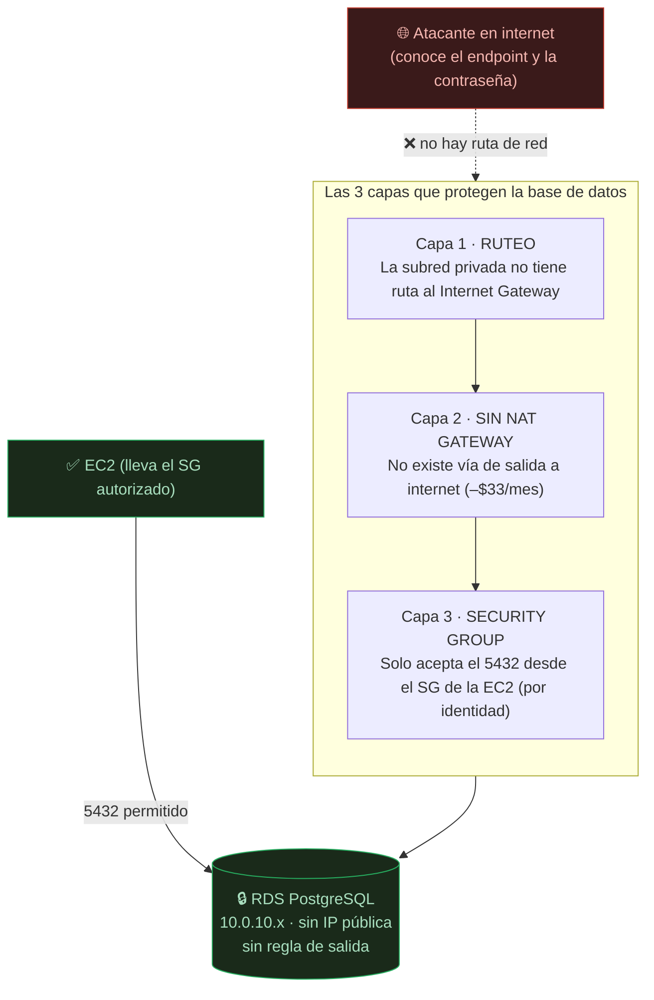
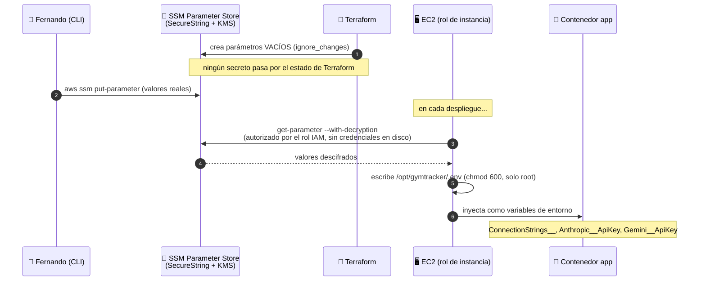
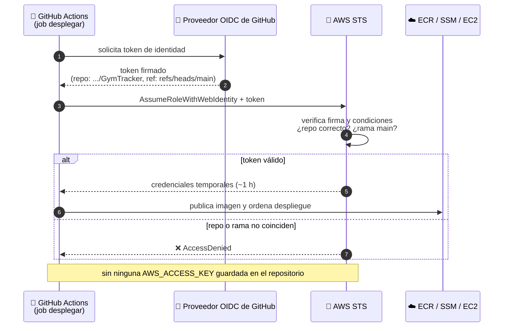
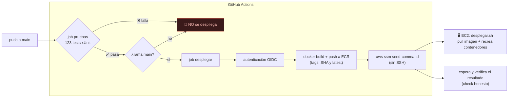
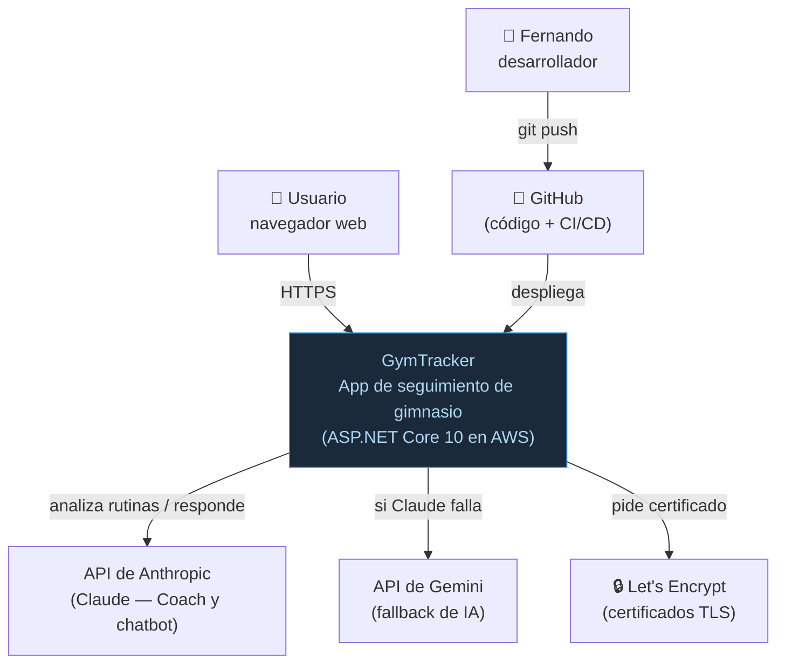
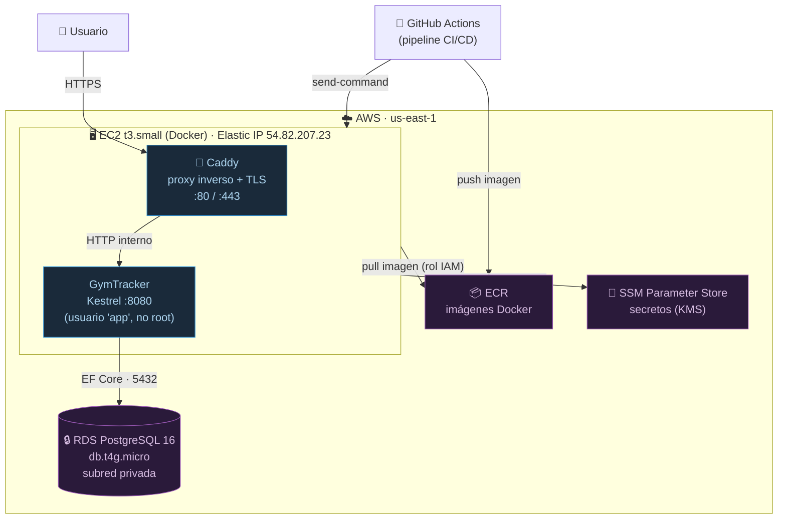
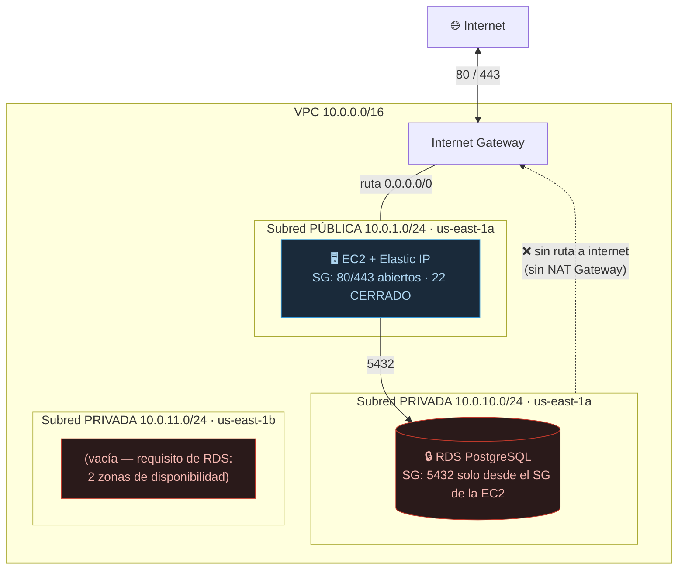
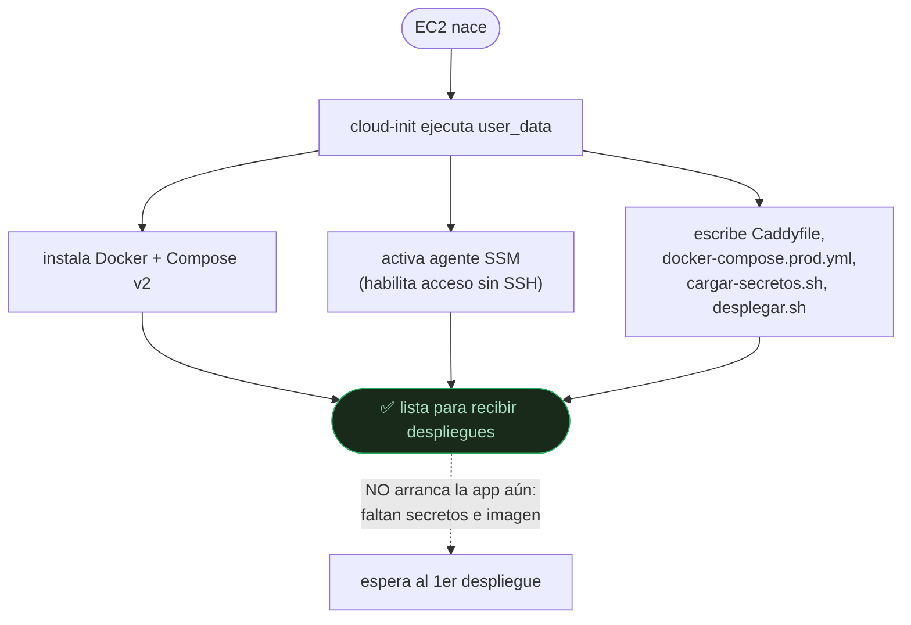

# ADR-09: Despliegue en AWS con EC2 + RDS, infraestructura como código (Terraform) y despliegue continuo

| Campo  | Valor |
|--------|-------|
| Autor  | Fernando Castro Hernández |
| Fecha  | 20/07/2026 |
| Estado | Aceptado |

---

## Contexto

Hasta este punto GymTracker estaba funcionalmente completo —catálogo, rutinas,
sesiones, mediciones, progreso, Coach IA y chatbot con contexto— pero **solo
corría en `localhost`**. El **ADR-02** ya declaraba esa limitación como deuda
consciente en su Vista de Despliegue:

> *"la app no es accesible fuera de mi máquina (se contempla migrar a la nube más
> adelante)"*.

Este ADR paga esa deuda. El objetivo: la aplicación accesible desde internet, con
HTTPS, sobre infraestructura **reproducible desde código** y desplegada
**automáticamente solo si las pruebas del ADR-08 pasan**.

El **ADR-08** es el cimiento de esta decisión, no un vecino. Desplegar de forma
automática sin una red de seguridad que verifique el código antes de publicarlo
sería trasladar el riesgo de "funciona en mi máquina" directamente a producción.
Por eso el orden fue: primero pruebas y CI (ADR-08), y el despliegue se encadena a
ellas.

---

## Decisión

Despliego GymTracker en **AWS**, sobre una arquitectura **EC2 + RDS PostgreSQL**,
descrita íntegramente con **Terraform**, y publicada por un **pipeline de
despliegue continuo** que extiende el workflow del ADR-08.

### 1. Cómputo: una sola EC2 con Docker, no contenedores gestionados

La aplicación corre en una instancia **EC2 `t3.small`** (2 vCPU, 2 GB RAM) con
Docker, ejecutando dos contenedores: la app y **Caddy** como proxy inverso.

Se descartó **ECS Fargate + Application Load Balancer** —la opción "de libro" para
contenedores en AWS— por costo: el ALB solo cuesta ~$16-22/mes, y sumado a Fargate
la factura sube a ~$45-60/mes **sin resolver ningún problema real** de una
aplicación de un usuario. Un balanceador de carga reparte tráfico entre varias
instancias; aquí hay una. Es infraestructura para un problema que no existe.

La instancia es **x86 (`t3.small`)** y no ARM, a diferencia de la base de datos.
La imagen Docker se construye para `linux/amd64` (ver `Dockerfile`), y una
instancia ARM (Graviton) no podría ejecutarla sin recompilar toda la aplicación.
El ahorro del ~20% de ARM no compensa ese riesgo en el cómputo.

### 2. Base de datos: RDS PostgreSQL gestionado, aislado en subred privada

La base pasa de un contenedor local a **Amazon RDS PostgreSQL 16
`db.t4g.micro`**. Lo que se gana al pagar un servicio gestionado en vez de correr
PostgreSQL en la misma EC2:

- **Backups automáticos** de 7 días con recuperación a un punto en el tiempo.
- **Parches del motor** aplicados por AWS.
- **Aislamiento de red real**: RDS vive en una subred **sin ruta a internet** y
  **sin IP pública**.
- Los datos **sobreviven** si la EC2 muere o se recrea.

Aquí sí se usa **ARM (`t4g`, Graviton)**: cuesta ~20% menos que la clase `t3`
equivalente y PostgreSQL corre nativo en ARM, sin contrapartida.

Se eligió **Single-AZ** y no Multi-AZ: este último mantiene una réplica en otro
centro de datos con conmutación automática, pero **cuesta exactamente el doble**
(~$23 contra ~$11.68/mes). Para una app académica de un usuario, pagar el doble
por evitar unos minutos de caída improbable no se justifica. Los backups diarios
cubren el riesgo que sí importa: perder datos.

### 3. La seguridad de la base no la decide la contraseña, la decide la red

Éste es el punto de diseño central. El aislamiento de RDS se construye en **tres
capas independientes**, ninguna de las cuales es la contraseña:

1. **Ruteo** — la subred privada no tiene ruta hacia el internet gateway. No
   existe camino de red hacia internet.
2. **Sin NAT Gateway** — no se añade la vía de salida que costaría ~$33/mes. RDS
   no la necesita: solo recibe conexiones, y AWS lo parchea desde su red interna.
3. **Security Group** — acepta el puerto 5432 **únicamente desde el security group
   de la EC2**, referenciado por identidad y no por IP. RDS no tiene ninguna regla
   de salida.

La prueba de que funciona: tras crear RDS, su endpoint resuelve por DNS a una IP
privada (`10.0.10.x`), pero el puerto 5432 es **inalcanzable desde internet**. No
hay rechazo ni error de autenticación: simplemente no hay ruta. Cualquiera puede
averiguar la dirección de la base y aun así no puede llegar a ella, **ni
conociendo la contraseña**.

### 4. Acceso sin SSH: SSM Session Manager

El **puerto 22 está cerrado por completo**. La administración de la instancia se
hace con **AWS Systems Manager Session Manager**: el agente SSM de la EC2 abre una
conexión **saliente** hacia AWS, y la terminal viaja por ese túnel. Consecuencias:

- **No existe llave privada** (`.pem`) que se pueda filtrar, perder o subir a git
  por accidente —justo el archivo que se termina extraviando en los cursos de AWS.
- **No hay puerto 22 expuesto** a los escáneres automáticos de internet.
- El acceso se autoriza con **IAM** y queda registrado en CloudTrail.

### 5. Secretos: SSM Parameter Store, nunca en el código ni en el estado

Las credenciales de producción —connection string de RDS y las API keys de
Anthropic y Gemini— viven en **SSM Parameter Store** como `SecureString`,
cifradas con KMS. Es el reemplazo en producción de User Secrets, coherente con la
regla que el proyecto ya seguía: **ningún secreto se versiona**.

El circuito completo, sin una sola credencial escrita en el servidor:

1. Terraform crea los parámetros **vacíos** (`lifecycle.ignore_changes` sobre el
   valor), de modo que **ningún secreto pasa por Terraform ni queda en su estado**.
2. Los valores reales se cargan por CLI (`aws ssm put-parameter`).
3. Un script en la EC2 los lee con el **rol de instancia** y los escribe en un
   `.env` con permisos `600`, que nunca sale de la máquina y se regenera en cada
   despliegue.

### 6. Identidades: roles IAM, cero llaves guardadas

Toda la autenticación es por **roles**, no por usuarios con llaves fijas:

- **Rol de instancia** — la EC2 lee ECR y Parameter Store sin credenciales en
  disco, y es administrable por SSM. Sus permisos están acotados al repositorio y
  a los parámetros de GymTracker, no a toda la cuenta.
- **Rol OIDC para GitHub Actions** — el pipeline se autentica ante AWS con un
  token de identidad federada emitido en cada ejecución, **sin ninguna
  `AWS_ACCESS_KEY` guardada en los Secrets del repositorio**. La confianza se
  restringe por condición a `repo:Fernando-Castro-Hernandez/GymTracker` y a
  `ref:refs/heads/main`: un workflow copiado a otro repositorio presentaría otro
  claim y AWS lo rechazaría. Omitir esa condición es el error más común con OIDC.

La instancia además exige **IMDSv2** (`http_tokens = required`): protege contra
SSRF, porque obtener las credenciales del rol requiere un token PUT previo que un
ataque de ese tipo no puede emitir.

### 7. HTTPS: Caddy con Let's Encrypt, no nginx

**Caddy** hace de proxy inverso y **obtiene y renueva el certificado TLS solo**,
de fábrica. Se prefirió sobre nginx porque con nginx habría que montar `certbot`
aparte y un cron de renovación cada 90 días —un paso manual más que se puede
olvidar—. Caddy termina el TLS y habla HTTP con Kestrel en la red interna de
Docker; el lado de la app se configuró con `UseForwardedHeaders` en `Program.cs`
(único cambio de código de todo el despliegue, además de `Migrate()` al arrancar).

### 8. Infraestructura como código: Terraform con estado en S3

Toda la infraestructura —45 recursos— se describe en archivos `.tf` versionados.
Las razones, más allá de la reproducibilidad:

- **`terraform destroy` apaga el gasto.** Entre demostraciones, destruir todo baja
  la factura de ~$34/mes a ~$0.55/mes, y `terraform apply` la recrea idéntica en
  ~12 minutos. Ésta es la razón práctica de haber usado IaC.
- **El estado vive en un bucket S3** con versionado y cifrado, no en el disco
  local. Si se pierde el estado, Terraform olvida que los recursos existen y ya no
  puede destruirlos: seguirían cobrando. El bucket se creó a mano una sola vez
  —Terraform no puede crear el sitio donde guarda su propio estado— y no se borra
  con `destroy`.

### 9. Despliegue continuo encadenado a las pruebas

El pipeline **extiende** el workflow del ADR-08 con un job `desplegar` que:

- Solo arranca si el job de pruebas pasa (`needs: pruebas`). **Si una sola de las
  123 pruebas falla, no se despliega.** Ese es el propósito de haber construido la
  suite antes.
- Solo corre en `main` (`if: github.ref == 'refs/heads/main'`), condición que
  coincide con la del rol OIDC en AWS.
- Se autentica por OIDC, construye y publica la imagen en ECR (etiquetas SHA y
  `latest`), y ordena el redespliegue por `aws ssm send-command` —sin SSH— y
  **espera a verificar el resultado**, para que el check no salga verde si el
  despliegue falla en la instancia.

---

## Arquitectura resultante (modelo C4)

Se documenta con **tres niveles de zoom** del modelo C4 —de lo general a lo
detallado— más el diagrama de arranque de la instancia. Cada nivel responde a una
pregunta distinta según quién lo lea.

### Nivel 1 — Contexto: ¿con qué habla el sistema?

La vista más alta. Quién usa GymTracker y de qué servicios externos depende.

### Nivel 2 — Contenedores: ¿qué piezas hay dentro?

Zoom a AWS. Los contenedores desplegables y cómo se comunican. Aquí se ve la
separación app / proxy / base y las herramientas de plataforma.

### Nivel 3 — Red: ¿cómo se aísla cada pieza?

El máximo detalle: la VPC, las subredes, el ruteo y los security groups. Es la
vista para entender la seguridad de red y reproduce lo que describe `network.tf`.

### Arranque de la instancia — de máquina vacía a servidor listo

Qué hace el `user_data` de Terraform la primera vez que nace la EC2. Es lo que
hace **reproducible** la infraestructura: `destroy` + `apply` devuelven esto
idéntico.

---

## Alternativas evaluadas y descartadas

| Alternativa | Por qué se descartó |
|---|---|
| **ECS Fargate + ALB** | ~$45-60/mes. Un balanceador y orquestación de contenedores resuelven el reparto de carga entre varias instancias; aquí hay una. Sobreingeniería para un usuario. |
| **PostgreSQL en la misma EC2** | Ahorra ~$14/mes pero pierde backups gestionados, aislamiento de red y la supervivencia de los datos si la instancia muere. La base guarda datos personales de salud. |
| **RDS Multi-AZ** | Cuesta el doble (~$23 vs ~$11.68) por conmutación automática ante la caída de un centro de datos. Los backups diarios cubren el riesgo real (pérdida de datos) a una fracción del costo. |
| **NAT Gateway para las subredes privadas** | ~$33/mes, casi tanto como el resto de la infraestructura junta. RDS no necesita salida a internet. |
| **Acceso por SSH con llave `.pem`** | Requiere abrir el puerto 22 y custodiar una llave privada que no expira. SSM Session Manager da terminal sin ninguna de las dos cosas. |
| **`AWS_ACCESS_KEY` en los Secrets de GitHub** | Una credencial permanente guardada fuera de AWS. OIDC la reemplaza por tokens temporales verificados en cada corrida. |
| **nginx + certbot para TLS** | Exige configurar la renovación del certificado a mano. Caddy lo hace de fábrica. |
| **Route 53 para el DNS** | El registro del dominio en AWS fue bloqueado por el filtro antifraude de la cuenta nueva. Se opta por Cloudflare, cuyo DNS es gratuito, ahorrando los $0.50/mes de la zona alojada. Reversible con un `dns.tf` de ~15 líneas. |
| **Estado de Terraform en local** | Perderlo deja recursos huérfanos cobrando sin forma de destruirlos. El bucket S3 con versionado lo evita. |
| **Aplicar migraciones con `dotnet ef` en el servidor** | Obligaría a instalar el SDK de .NET en la EC2, contradiciendo el objetivo de la imagen Docker. Se aplican al arrancar la app, con el trade-off documentado de una sola instancia. |

---

## Consecuencias

### Costo

| Recurso | $/mes |
|---|---|
| EC2 `t3.small` | 15.18 |
| RDS `db.t4g.micro` Single-AZ | 11.68 |
| Elastic IP (IPv4 pública) | 3.65 |
| RDS almacenamiento 20 GB | 2.30 |
| EBS 30 GB gp3 | 2.40 |
| ECR, SSM, IAM, VPC, Security Groups | ~0.00 |
| **Total encendido** | **~$35/mes** |
| **Total con `terraform destroy`** | **~$0.55/mes** |

### Positivas

- La aplicación es accesible desde internet, con TLS automático una vez conectado
  el dominio.
- La infraestructura entera se recrea desde cero con un comando, y se apaga con
  otro para no pagar entre demostraciones.
- Ninguna credencial de AWS vive en disco: ni en el servidor, ni en GitHub, ni en
  el estado de Terraform.
- Es imposible publicar una versión que no compile o que rompa una prueba.

### Negativas y deuda aceptada

- **Migración al arrancar con una sola instancia.** `Migrate()` corre al iniciar
  la app. Con varias instancias arrancando a la vez habría condición de carrera;
  con una sola no. Habría que revisarlo al escalar horizontalmente.
- **La contraseña de RDS queda en el estado de Terraform** en texto plano
  (limitación conocida de la herramienta). Mitigado: el bucket S3 está cifrado y
  con acceso público bloqueado.
- **Dominio pendiente.** Mientras no se registre `novuxtracker.com` en Cloudflare,
  la app sirve por HTTP en la IP pública sin certificado.

---

## Evidencia: lo que solo se descubre desplegando

Un valor de este ADR es documentar los fallos que **ningún test ni prueba local
podía atrapar**, porque son propiedades del entorno desplegado y no del código:

- **Permisos del volumen de Data Protection.** En producción el contenedor corre
  como el usuario `app` (uid 1654, por el `USER app` del Dockerfile), pero Docker
  crea los volúmenes como `root:root`. La app no podía escribir sus llaves de
  cifrado de cookies y toda página que tocara Identity (registro, login) fallaba
  con `UnauthorizedAccessException` —la portada cargaba porque no usa esas llaves—.
  En desarrollo nunca aparece: ahí el contenedor corre como root. Se resolvió con
  un contenedor auxiliar que cede el volumen al usuario `app` antes de arrancar.
- **El AMI y el tamaño de disco.** Un filtro de AMI demasiado amplio seleccionaba
  la variante de ECS, que exige 30 GB de disco; se afinó al AMI estándar.
- **El shebang del `user_data`.** Un heredoc indentado (`<<-EOT`) dejaba
  `#!/bin/bash` con cuatro espacios delante, el kernel no lo reconocía como
  intérprete y `cloud-init` fallaba en 9 segundos sin instalar nada —**sin que el
  `apply` reportara ningún error**—. Se resolvió con `templatefile()`.

Estos tres son la contraparte práctica de la tesis del ADR-08: los fallos más
costosos no lanzan una excepción en tu máquina. Aquí, además, ni siquiera ocurren
en tu máquina.

---

## Relación con otros ADR

- **ADR-02** — actualiza su Vista de Despliegue: lo que era un plan pasa a ser el
  estado real.
- **ADR-03** — la arquitectura en capas hace que el `Dockerfile` empaquete solo lo
  necesario; el código de pruebas no viaja al servidor.
- **ADR-07** — las API keys del Coach y el chatbot pasan de User Secrets a SSM
  Parameter Store sin cambiar el código: se leen de configuración igual que en
  desarrollo.
- **ADR-08** — es el cimiento: el despliegue continuo se encadena a sus pruebas.
