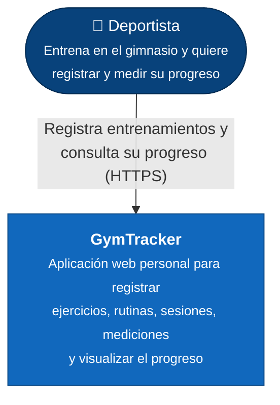

# Diagrama C4 — Nivel 1: Contexto del Sistema

**GymTracker** — Bitácora personal de entrenamiento de gimnasio.

Este nivel responde: **¿Qué es el sistema y quién lo usa?**
Es la vista más general. No muestra tecnología: solo el sistema como una caja y
los actores que interactúan con él. Cualquier persona, técnica o no, debe poder
entenderlo.

## Para quién es y qué responde

- **Audiencia:** cualquiera (usuario final, profesor, alguien ajeno al proyecto).
- **Pregunta que responde:** ¿qué hace el sistema y quién lo usa?
