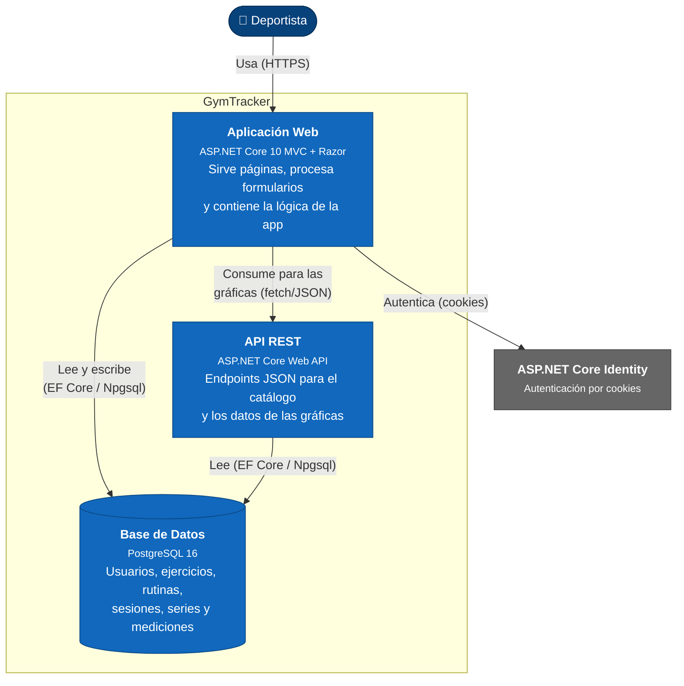

# Diagrama C4 — Nivel 2: Contenedores

**GymTracker** — Vista de contenedores.

Este nivel responde: **¿De qué piezas grandes se compone el sistema?**
Hace *zoom-in* sobre la caja de GymTracker del Nivel 1 y muestra las unidades
desplegables (aplicaciones, base de datos) y cómo se comunican. Aquí ya aparece
la tecnología.

## Para quién es y qué responde

- **Audiencia:** equipo técnico, quien despliega o mantiene el sistema.
- **Pregunta que responde:** ¿qué aplicaciones/almacenes hay y cómo se comunican?
- **Notas:** la API vive dentro de la misma aplicación ASP.NET Core (no es un
  servicio separado), pero se modela como contenedor lógico distinto porque
  cumple un rol propio: exponer datos JSON para las visualizaciones. La
  autenticación se apoya en Identity, que persiste sus tablas en la misma BD.
