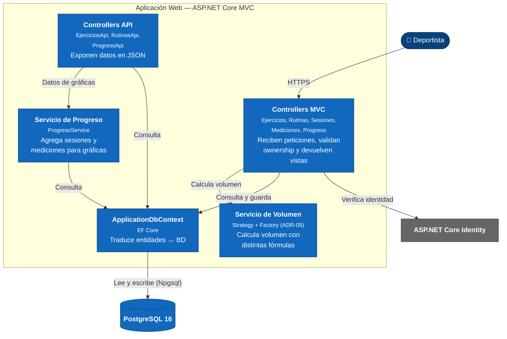

# Diagrama C4 — Nivel 3: Componentes

**GymTracker** — Vista de componentes de la Aplicación Web.

Este nivel responde: **¿Qué hay dentro de la pieza principal?**
Hace *zoom-in* sobre el contenedor "Aplicación Web" del Nivel 2 y muestra sus
componentes internos (controllers, servicios, acceso a datos) y cómo colaboran.

## Para quién es y qué responde

- **Audiencia:** desarrolladores que van a modificar el interior de la aplicación.
- **Pregunta que responde:** ¿qué componentes hay dentro y cómo colaboran?
